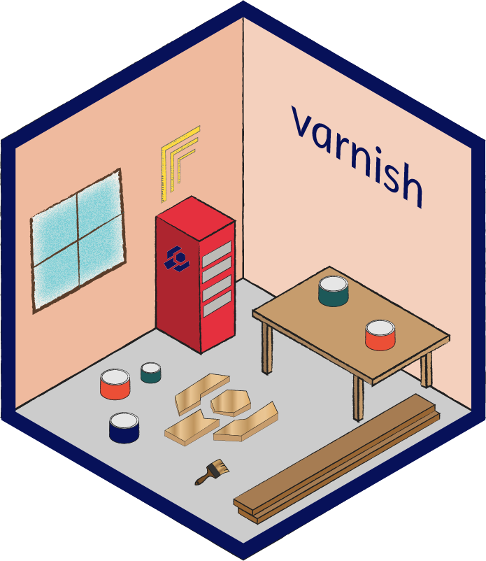

# {uom-varnish}: Template for The Carpentries Workbench 

[](https://carpentries.r-universe.dev)

This project is a Melbourne Bioinformatics fork of [The Carpentries
Workbench](https://carpentries.github.io/workbench). It serves as a template
for internally developed Carpentries style lessons adapted from [{pkgdown}]. As this is a bespoke theme,
it must be installed directly, rather than using the default that is installed via the [{sandpaper}] package.

The changes to the theme replace The Carpentries branding with the University of
Melbourne [brand toolkit](https://brandhub.unimelb.edu.au/).
Additionally, relevant additional links to training resources have been included
in the footer.

## Release cycle

This fork maintains its own release cycle independent of the upstream
[{varnish}](https://github.com/carpentries/varnish) package. We aim to track
upstream releases as closely as practical, incorporating relevant upstream
changes while preserving University of Melbourne branding and customisations.

The html templates use [mustache templating
language](https://mustache.github.io/mustache.5.html) while the CSS and
JavaScript are compiled and minified on GitHub Actions.

## Installation

This fork of varnish should **not** be used in official carpentries repositories,
it is intended for internally developed courses at the University of Melbourne.

In order to use this fork of varnish you must update `config.yaml` to include the
below lines under the `# Customisation` section (update `[user]` with your
user/organisation  and `[repo]` with the repository name replacing the line with
a custom domain if required).

```yaml
varnish: melbournebioinformatics/uom-varnish@main
url: '[user].github.io/[repo]'
```
There is no need to call this package directly, once `config.yaml` has been updated
[{sandpaper}] will detect it and copy the styling and templates to your lesson
website when building in GitHub pages.

Once `config.yaml` has been customised, [typical
guides](https://carpentries.github.io/sandpaper) from The Carpentries can be
followed to deploy locally or to GitHub pages.

### Applying Varnish locally

When rendering the site locally the varnish will not, by default, be applied since
it is not available. A few extra steps to setup up and install the necessary
packages are required. You can install the varnish system wide using [{devtools}]

``` r
> install.packages("devtools")
> devtools::install_github("melbournebioinformatics/uom-varnish")
```

Alternatively you can install the varnish under a [{renv}].
If you don't already have `renv` installed then install it with
`install.packages("renv")`. Then initialise an `renv` in the workbench repository
you have cloned.

``` bash
cd ~/path/to/workbench/repo/
Rscript -e "renv::init()"
```

Start R and install this varnish and the [{sandpaper}] package (which will pull in
all dependencies) in the `renv` and snapshot it.

``` r
> renv::install("melbournebioinformatics/uom-varnish")
> options(repos = c(
    carpentries = "https://carpentries.r-universe.dev/",
    CRAN = "https://cran.rstudio.com/"))
> renv::install("sandpaper", dep = TRUE)
> renv::snapshot()
```

You can now build and serve the pages with University of Melbourne varnish.
```r
> sandpaper::serve()
```

**NB** If you find the varnish _isn't_ applied then you may need to first load
the library with `library(uomvarnish)`.

## CSS and JavaScript

The CSS and JavaScript used for the lessons are minified using SASS and
uglifyjs. Their sources live in the [`source/`](source/) folder with directives
to include their dependencies (bootstrap, jquery, feather).

The minified versions are built via GitHub actions any time one of the source
files is changed. 

To build this locally, you need to make sure to have a working version of
`node` and `npm`, which can be installed [via the node version manager, nvm](https://github.com/nvm-sh/nvm#intro).

### Install dependencies

Once you have `nvm` installed, you can install the node packages locally (they
will install in the _`node_modules/`_ directory and will be ignored by git)
with the following command:

```sh
nvm install 24 # make sure we are using node version 24
npm install    # install the packages defined in package.json
```

### Minify CSS and JS

Once you have the dependencies installed, you can run the following scripts to
minify the CSS and JS:

```sh
bash squash-sass.sh     # use the sass node module to compile CSS
bash squash-a-script.sh # use the uglifyjs node module to compile JS
```

## HTML Templates

We have customized the following templates:

 - [content-chapter] displays the episodes for the lessons
 - [content-syllabus] is the landing page for the lessons
 - [content-extra] is used for pages that are not chapters and do not need
   positional navigation
 - [content-overview] is like content-extra, but is meant for the home page of
   an overview lesson
 - [head] contains the metadata and script loading
 - [navbar] is a bit of misnomer, but it contains the sidebar navigation
 - [header] contains metadata and favicons
 - [footer] contains navigation, credits, and JSON metadata
 - [layout] pulls everything together

### Parameters

At the moment, {varnish} uses a mix of global parameters provided in a YAML file
generated for {pkgdown} and parameters (both global and page-specific) passed
directly to `pkgdown::render_page()`. All of these parameters are provisioned
by {sandpaper}, but it should be noted that **this particular structure is
expected to change** as we move to systems such as quarto, which use pandoc
templates.

#### pkgdown

[{pkgdown}] provides the `{{ #site }}{{ root }}{{ /site }}` parameter by default,
which inserts the path to the root folder when viewed locally and inserts the
URL when viewed on a server.

#### YAML

These parameters are recorded in a workbench lesson under `site/_pkgdown.yaml`

```yaml
title: {{ title }} # needed to set the site title
home:
  title: Home
  strip_header: true
  description: ~
template:
  package: varnish
  params:
    time: {{ time }}
    source: {{ source }}
    branch: {{ branch }}
    contact: {{ contact }}
    license: {{ license }}
    handout: {{ handout }}
    cp: {{ cp }}
    lc: {{ lc }}
    dc: {{ dc }}
    swc: {{ swc }}
    carpentry: {{ carpentry }}
    carpentry_name: {{ carpentry_name }}
    carpentry_icon: {{ carpentry_icon }}
    life_cycle: {{ life_cycle }}
    pre_alpha: {{ pre_alpha }}
    alpha: {{ alpha }}
    beta: {{ beta }}
```

Each of these parameters can be accessed via the `{{ yaml }}` mustache context.
For example, this adds a paragraph describing the license provided that the
`{{ license }}` parameter is present in the yaml: 

```html
{{#yaml}}{{#license}}
<p>Materials licensed under <a href="{{#site}}{{root}}{{/site}}LICENSE.html">{{license}}</a> by the authors</p>
{{/license}}{{/yaml}}
```


#### Global

(TODO: write descriptions of these parameters)

#### Page-specific

 - `{{ instructor }}`: a boolean indicating instructor view
 - `{{ aio }}`: a boolean indicating that the aio page should be included
 - `{{ this_page }}`: The file-only HTML path of the current page (e.g. `index.html` or `introduction.html`).
 - `{{{ schedule }}}`: The HTML sidebar of the schedule of episodes. 
 - `{{{ resources }}}`: an additional part of the sidebar giving extra resource elements avaialable in mobile view.

[{pkgdown}]: https://r-lib.github.io/pkgdown
[{sandpaper}]: https://github.com/zkamvar/sandpaper
[content-chapter]: inst/pkgdown/templates/content-chapter.html
[content-syllabus]: inst/pkgdown/templates/content-syllabus.html
[content-extra]: inst/pkgdown/templates/content-extra.html
[head]: inst/pkgdown/templates/head.html
[header]: inst/pkgdown/templates/header.html
[layout]: inst/pkgdown/templates/layout.html
[navbar]: inst/pkgdown/templates/navbar.html
[footer]: inst/pkgdown/templates/footer.html
